# Tutorial de Anotação: Contratos e Licitações

Esse repositório descreve o tutorial de anotação em publicações de contratos e licitações presentes nas edições (documentos) do Diário Oficial do Distrito Federal (DODF).

## Autores

Responsáveis pela elaboração e revisão desse tutorial:

- Vinícius R. P. Borges
- Manuela M. C. de Souza
- Tatiana F. Pereira
- Vitor Vasconcelos

## Ferramenta NidoTat

A ferramenta usada para realizar as anotações será o NidoTat, um fork do [TeamTat](https://www.teamtat.org/). Essa é uma ferramenta online para anotação que permite que várias pessoas anotem e revisem um mesmo documento facilitando a geração de uma base de dados padrão ouro.

Algumas funcionalidades foram incluídas no NidoTat para melhor atender às necessidades do projeto [KnEDLe](https://unb-knedle.github.io/nido.html). Dentre elas, constam alguns atalhos de teclado, cujos valores padrão são descritos na tabela abaixo:

Função | Tecla
------- | -------
Navegação: próxima palavra | d
Navegação: palavra anterior | a
Navegação: próximo caractere | e
Navegação: caractere anterior | q
Navegação: avançar várias palavras | s
Navegação: voltar várias palavras | w
Seleção de texto | SHIFT + tecla de navegação
Percorrer lista de entidades selecionadas | CTRL
Adicionar anotação de entidade | SPACE
Remover anotação de entidade | r
Adicionar relação | v

Outra melhoria que vale a pena mencionar é a possibilidade de excluir anotações usando o botão direito do mouse.

A anotação dos documentos do DODF será feita a nível de atos de entidades. Os atos as serem anotados estão apresentados a seguir e as respectivas entidades estão nos tutoriais individuais dos atos.

*   [Aviso de Licitação](aviso_licitacao/README.md)
*   [Aviso de Revogação/Anulação de Licitação](aviso_revogacao_anulacao_licitacao/README.md)
*   [Aviso de Suspensão de Licitação](aviso_suspensao_licitacao/README.md)
*   [Extrato de Aditamento Contratual](extrato_aditamento_contratual/README.md)
*   [Extrato de Contrato](extrato_contrato/README.md)
*   [Extrato de Convênio](extrato_convenio/README.md)

## Anotação Passo-a-passo

### 1) Pegue sua URL de acesso ao NidoTat

Primeiramente, você deve pegar sua URL para acesso ao NidoTat na planilha que está disponível na página da disciplina Aprender3. Com ela, é possível acessar os projetos e os documentos a serem anotados, portanto, é importante salvá-la em um lugar em que possa ser acessada posteriormente.

Ao acessar a URL, você será redirecionado para a página de perfil de usuário do NidoTat, em que é possível modificar seu nome de usuário e enviar a URL de acesso por e-mail.

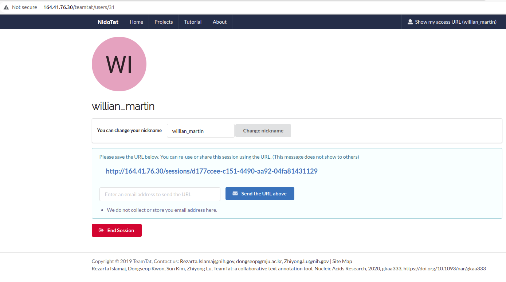

Primeiramente, acesse a aba "Projects" e encontre o projeto atualmente em fase de anotação, que sempre será definido pelo professor durante a disciplina.

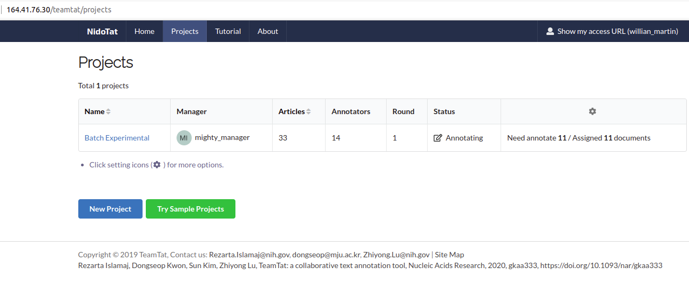

Para acessar os documentos a serem anotados, basta clicar em "Projects" e você verá a seguint tela:

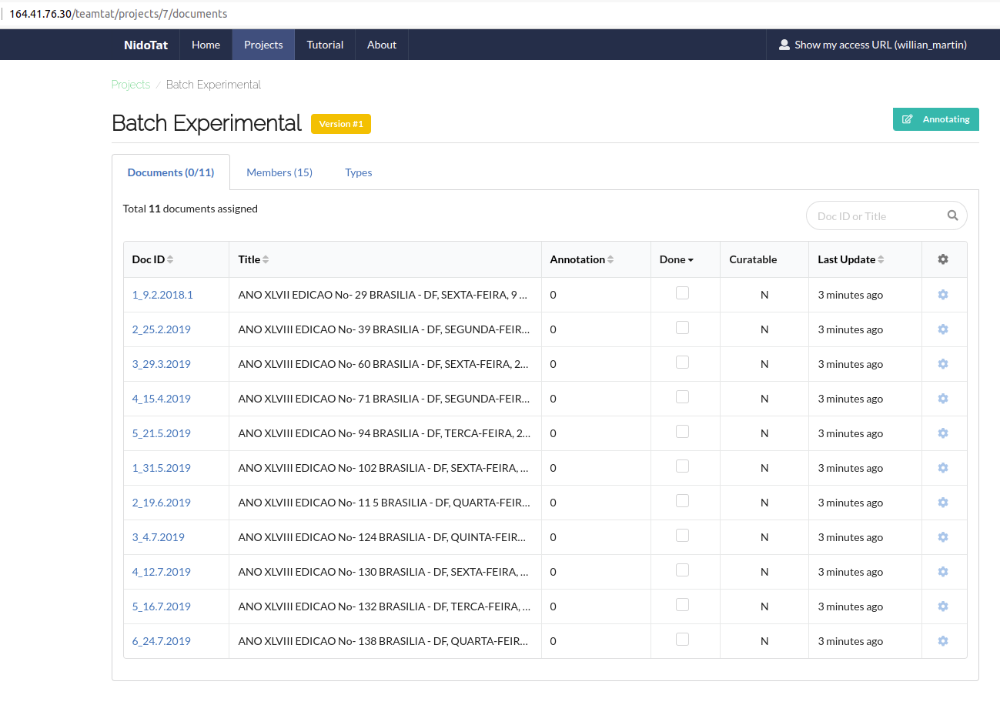

Os rótulos empregados no processo de anotação estão disponíveis na aba "Types".

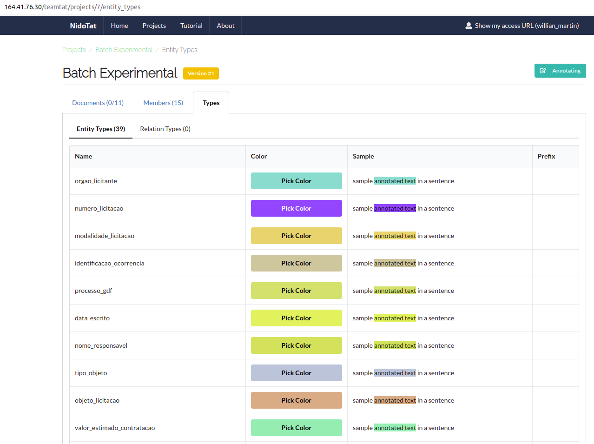

### 2) Configuração do ambiente

Antes de começar a fazer a anotação em si, devemos fazer a configuração do ambiente de anotação. Primeiramente, você deve acessar um dos documentos a serem anotados para iniciar tal configuração. Você verá a seguinte tela que é basicamente composta por três paineis:

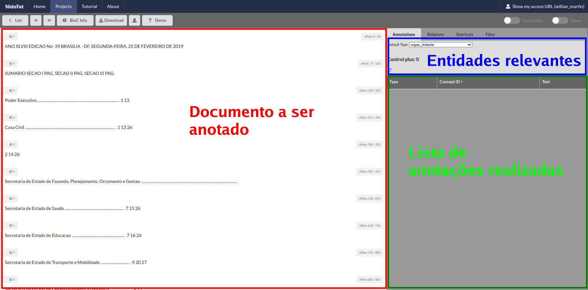

Para facilitar a escolha das entidades a serem anotadas no texto, clique na aba "Filter" e marque as entidades associadas aos atos que você está anotando. Por exemplo, na tela abaixo, as entidades relacionadas aos atos de "Extrato de Contrato" foram selecionadas. No final da tela, clique em "Save" (láááá embaixo da tela). :

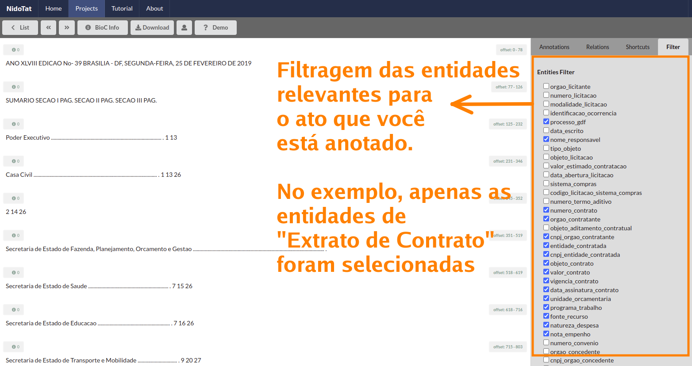

voltando para a tela principal de anotação de documentos, você verá as entidades que você selecionou da seguinte maneira: *i - a_i*. O número inteiro *i* é utilizado para se fazer a seleção da i-ésima entidade por meio do teclado (o que vai facilitar muito no processo de anotação). Em breve abordaremos essa utilidade.

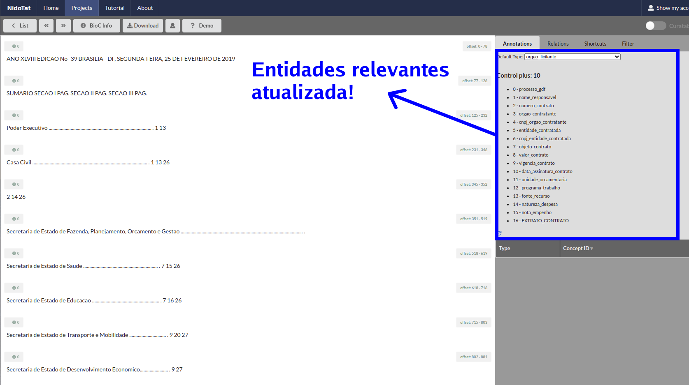

Pronto, já podemos começar a anotar o documento no painel que está com fundo branco!

### 3) Começando a anotação

Para encontrar os atos a serem anotados no documento, pesquise, pressionando CTRL+F, a palavra chave do ato em questão. Aqui vamos mostrar a anotação de uma publicação relacionada a um ato de "Extrato de Contrato". Assim, seguindo a estratégia proposta para encontrar atos de "Extrato de Contrato", vamos fazer a busca pelo primeiro termo sugerido "Extrato de Contrato". A pesquisa também indicará quantos atos desse tipo existem no documento.

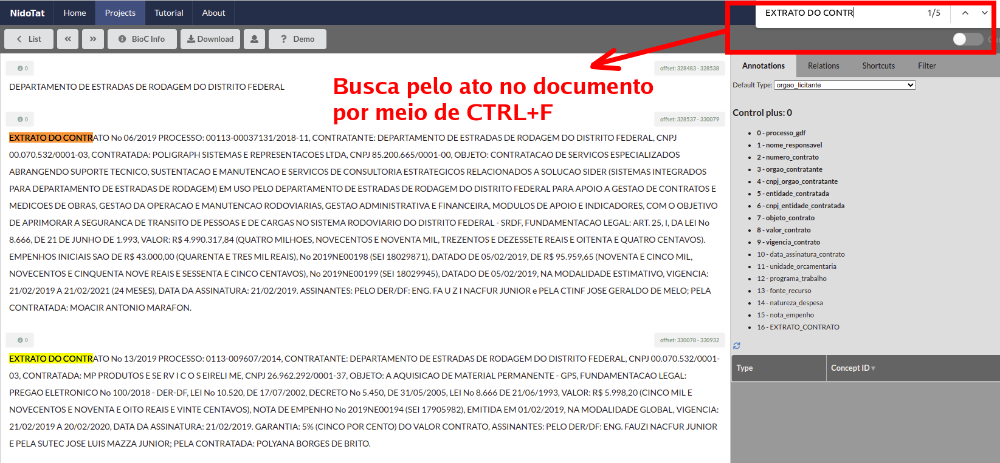

Podemos ver na imagem acima que nesse trecho do documento, existem duas publicações relaciondas com ato de "Extrato de Contrato". O NidoTat funciona assim: selecionamos uma entidade na lista de entidade utilizando o menu dropdown ou o teclado, e em seguida, selecionamos o termo ou a sentença que corresponde à entidade selecionada.

Suponha que queiramos anotar a entidade "Processo GDF" nas publicações recentemente encontradas. Podemos selecionar no menu drop down, por meio do mouse, a entidade "processo_gdf" (veja a coluna labels no tutorial específico do Ato de "Extrato de Contrato") ou apertar a tecla **0** no teclado, pois é o número inteiro associado à essa entidade. Repare na imagem abaixo que as entidades em negrito estão ativadas e para selecionar entidades associadas a números inteiros entre *10* e *17*, basta apertar **Ctrl** - as entidades em negrito são aquelas ativadas para seleção pelo teclado:

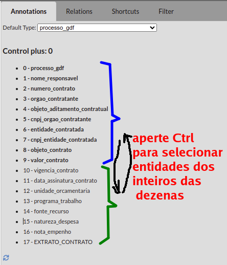

Em seguida, para ganhar tempo, marcamos (anotamos) os dois termos nas publicações associadas a "Processo GDF" utilizando o mouse. Assim, posicionamos o cursor no primeiro caractere do termo e arrastamos o mouse até último caractere desse termo sempre considerando a entidade em anotação. Ao final, todo o texto marcado ficará colorido e rotulado com o label selecionado "processo_gdf". No exemplo abaixo, veja como fica:

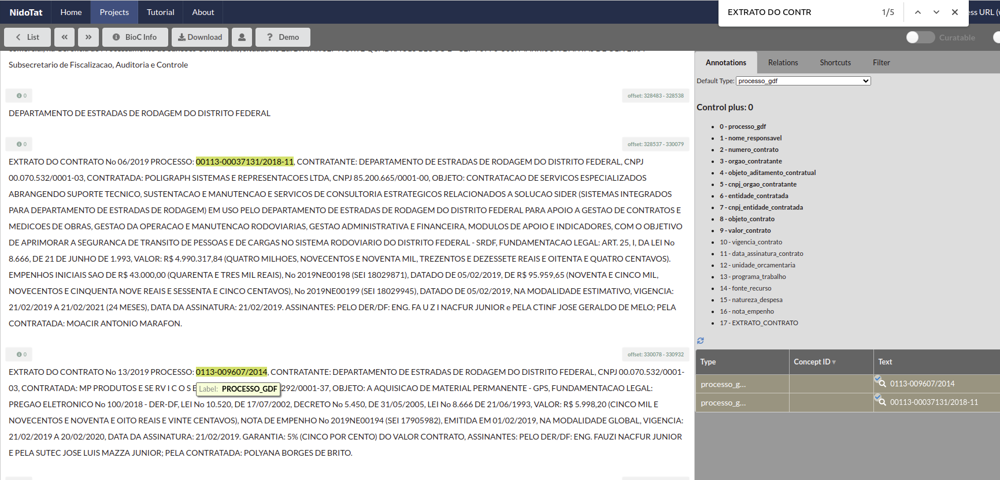

Depois disso, as demais entidades relacionadas ao ato de "Extrato de Contrato" devem ser anotadas. Veja como fica a anotação dessas publicações aos poucos:

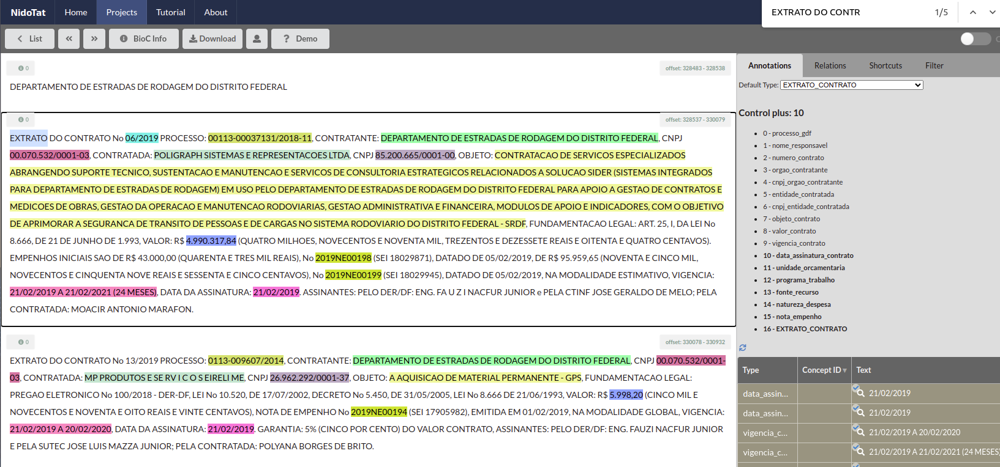

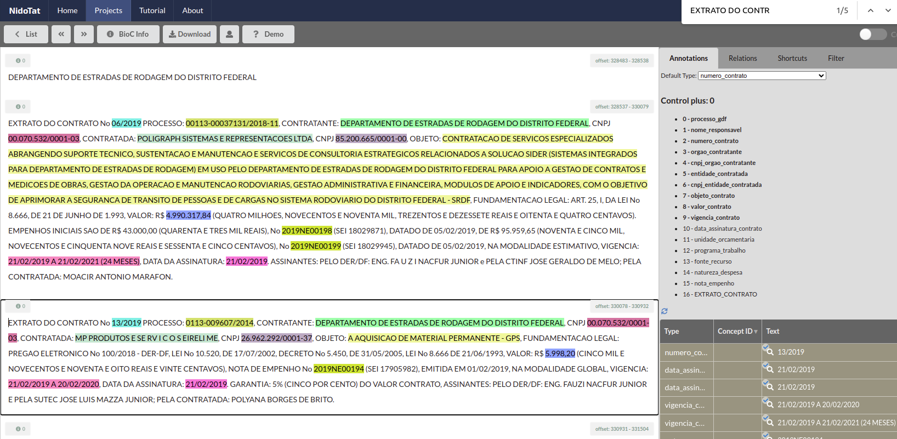

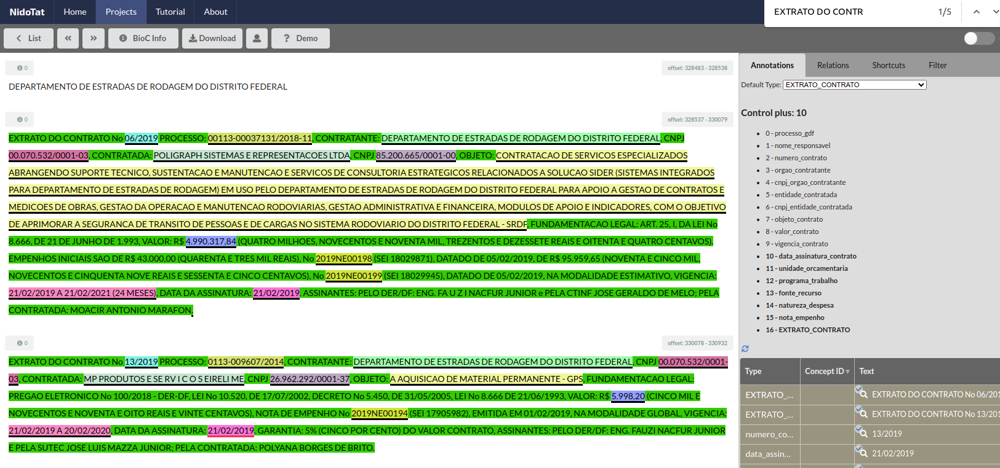

Outra forma de anotar as entidades é através de atalhos do teclado. Selecione o parágrafo que contém a entidade e, para percorrer as palavras, aperte "D" para ir uma palavra para frente, "A" para ir uma palavra para trás, "S" para ir algumas palavras para frente e "W" para ir algumas palavras para trás. Para ir um caractere para frente ou para trás, aperte "E" e "Q", respectivamente. Para selecionar um conjunto de palavras, aperte "SHIFT" e os caracteres listados anteriormente.

Caso tenha feito uma anotação incorreta e queira apagá-la, selecione, através dos atalhos de teclado, a anotação e, em seguida, aperte "R". Esses atalhos não são fixos e podem ser alterados na aba "Shortcuts".

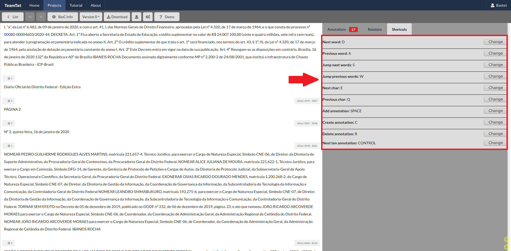

Após anotar as entidades do ato, é necessário anotar o ato completo. Para isso, escolha o rótulo do ato na aba esquerda e selecione o texto correspondente. Uma tela pop-up irá aparecer, pois já existem anotações no texto selecionado. Nessa tela, escolha a opção "Create New Annotation".

Por fim, quando todo o documento estiver pronto, clique em "DONE".

