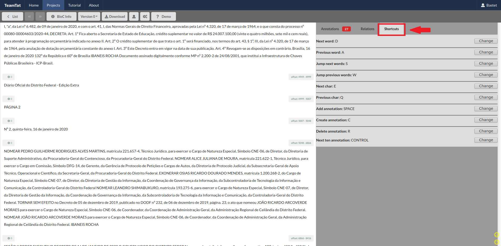

# Tutorial de Anotação: Contratos e Licitações

Esse repositório descreve o tutorial de anotação em publicações de contratos e licitações presentes nas edições (documentos) do Diário Oficial do Distrito Federal (DODF).

## Autores

Responsáveis pela elaboração e revisão desse tutorial:

- Vinícius R. P. Borges
- Manuela M. C. de Souza
- Tatiana F. Pereira
- Vitor Vasconcelos

## Ferramenta NidoTat

A ferramenta usada para realizar as anotações será o NidoTat, um fork do [TeamTat](https://www.teamtat.org/). Essa é uma ferramenta online para anotação que permite que várias pessoas anotem e revisem um mesmo documento facilitando a geração de uma base de dados padrão ouro.

Algumas funcionalidades foram incluídas no NidoTat para melhor atender às necessidades do projeto [KnEDLe](https://unb-knedle.github.io/nido.html). Dentre elas, constam alguns atalhos de teclado, cujos valores padrão são descritos na tabela abaixo:

Função | Tecla
------- | -------
Navegação: próxima palavra | d
Navegação: palavra anterior | a
Navegação: próximo caractere | e
Navegação: caractere anterior | q
Navegação: avançar várias palavras | s
Navegação: voltar várias palavras | w
Seleção de texto | SHIFT + tecla de navegação
Percorrer lista de entidades selecionadas | CTRL
Adicionar anotação de entidade | SPACE
Remover anotação de entidade | r
Adicionar relação | v

Outra melhoria que vale a pena mencionar é a possibilidade de excluir anotações usando o botão direito do mouse.

A anotação dos documentos do DODF será feita a nível de atos de entidades. Os atos as serem anotados estão apresentados a seguir e as respectivas entidades estão nos tutoriais individuais dos atos.

*   [Aviso de Licitação](aviso_licitacao/README.md)
*   [Aviso de Revogação/Anulação de Licitação](aviso_revogacao_anulacao_licitacao/README.md)
*   [Aviso de Suspensão de Licitação](aviso_suspensao_licitacao/README.md)
*   [Extrato de Aditamento Contratual](extrato_aditamento_contratual/README.md)
*   [Extrato de Contrato](extrato_contrato/README.md)
*   [Extrato de Convênio](extrato_convenio/README.md)

## Anotação Passo-a-passo

### 1) Pegue sua URL de acesso ao NidoTat

Primeiramente, você deve pegar sua URL para acesso ao NidoTat na planilha que está disponível na página da disciplina Aprender3. Com ela, é possível acessar os projetos e os documentos a serem anotados, portanto, é importante salvá-la em um lugar em que possa ser acessada posteriormente.

Ao acessar a URL, o anotador é direcionado para a página de perfil de usuário do NidoTat, em que é possível modificar seu nome de usuário e enviar a URL de acesso por e-mail.

Primeiramente, acesse a aba "Projects" e encontre o projeto atualmente em fase de anotação, que sempre será definido pelo professor durante a disciplina.

Para acessar os documentos a serem anotados, basta clicar em "Projects" e, em seguida, no projeto referente ao documento desejado.

Os rótulos usados para a anotação estão disponíveis na aba "Types".

### 2) Configuração do ambiente

Para fazer a anotação em si, escolha qual a entidade deve ser anotada e selecione seu rótulo na aba esquerda da tela. Para selecionar a entidade, aperte a tecla com o número correspondente da entidade, 0 a 9. Caso a entidade não esteja nessa faixa, aperte "CTRL" para mudar a faixa de valores. A faixa escolhida será apresentada em negrito.

### 3) Começando a anotação

Para encontrar os atos a serem anotados no documento, pesquise, pressionando CTRL+F, a palavra chave do ato em questão. Este tutorial mostra a anotação de um ato de exoneração como exemplo, então será pesquisada a palavra "exonerar". A pesquisa também indicará quantos atos desse tipo existem no documento.

Após isso, as entidades serão anotadas. Se existirem poucos atos do tipo escolhido no documento, 20 ou menos, é recomendado anotar uma entidade por vez, ou seja, anote todos os nomes de servidores do documento,  todas as matrículas do documento e assim por diante. Caso haja muitos atos, é recomentado anotar as entidades por parágrafo.

Então, com o mouse, selecione o texto correspondente a esse rótulo.

O texto selecionado ficará grifado com a cor correspondente ao rótulo escolhido.

Outra forma de anotar as entidades é através de atalhos do teclado. Selecione o parágrafo que contém a entidade e, para percorrer as palavras, aperte "D" para ir uma palavra para frente, "A" para ir uma palavra para trás, "S" para ir algumas palavras para frente e "W" para ir algumas palavras para trás. Para ir um caractere para frente ou para trás, aperte "E" e "Q", respectivamente. Para selecionar um conjunto de palavras, aperte "SHIFT" e os caracteres listados anteriormente.

Caso tenha feito uma anotação incorreta e queira apagá-la, selecione, através dos atalhos de teclado, a anotação e, em seguida, aperte "R".

Esses atalhos não são fixos e podem ser alterados na aba "Shortcuts".

Após anotar as entidades do ato, é necessário anotar o ato completo. Para isso, escolha o rótulo do ato na aba esquerda e selecione o texto correspondente. Uma tela pop-up irá aparecer, pois já existem anotações no texto selecionado. Nessa tela, escolha a opção "Create New Annotation".

Por fim, quando todo o documento estiver pronto, clique em "DONE".

